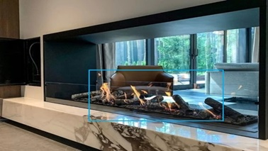
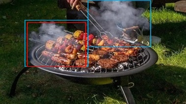
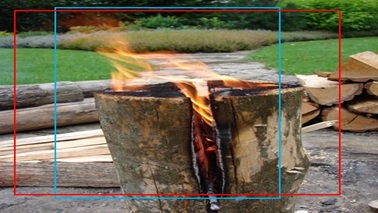
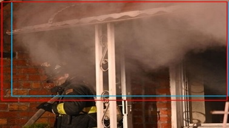
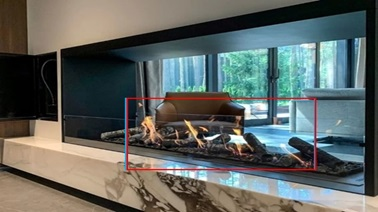
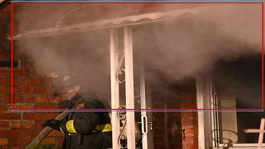

<h1 align="center">
<strong>Fire and Smoke Detection with Burning Intensity Representation</strong>
</h1>

<p align="center">
  

<p align="center">
  <a href="https://link.springer.com/chapter/10.1007/978-981-97-8795-1_14" target='_blank'>
    
  </a>
&nbsp;&nbsp;&nbsp;
 <a href="https://arxiv.org/abs/2410.16642" target='_blank'>
    
  </a>
&nbsp;&nbsp;&nbsp;
  <a href="https://xiaoyihan6.github.io/FSD/" target='_blank'>
    
  </a>
&nbsp;&nbsp;&nbsp;
  <a href="https://github.com/XiaoyiHan6/FSDmethod" target='_blank'>
    
  </a>
&nbsp;&nbsp;&nbsp;
  <a href="https://github.com/XiaoyiHan6/FSDmethod" target='_blank'>
    

  </a> 
</p>
 <p align="center">
  <font size=5><strong>Fire and Smoke Detection with Burning Intensity Representation</strong></font>
    <br>
        <a href="https://xiaoyihan6.github.io/">Xiaoyi Han</a>,
	<a >Yanfei Wu</a>,
        <a href="https://tpcd.github.io/">Nan Pu</a>,
        <a href="https://person.zju.edu.cn/fengzunlei">Zunlei Feng</a>,<br>
        <a href="https://person.zju.edu.cn/zhangqf">Qifei Zhang</a>,
	<a href="https://person.zju.edu.cn/beiyj">Yijun Bei</a>,
        <a href="https://faculty.hfut.edu.cn/ChengLechao/zh_CN/index.htm">Lechao Cheng</a><br>
    <br>
  Zhejiang University & University of Trento & Hefei University of Technology
  <br>
  Accepted to MM Asia 2024
  </p>
</p>

---

<h2 align="center">
<strong>Note</strong>
</h2>

Dear Visitors,
<br>
We would like to inform you that the currently provided code supports only the following object detection models (or other components):
- SSD
- RetinaNet
- FCOS
- Attentive Transparency Detection Head (ATDH) [We placed the ATDH in FCOS]
<br>
Best regards,
<br>
Xiaoyi Han

---

<h2 align="center">
<strong>Compiling environment</strong>
</h2>

```
python == 3.8.5

torch == 1.11.0+cu113

torchaudio == 0.11.0+cu113

torchvision == 0.12.0+cu113

pycocotools == 2.0.4

numpy

Cython

matplotlib

opencv-python  (maybe you want to use skimage or PIL etc...)

scikit-image

tensorboard

tqdm

...

```

---

<h2 align="center">
<strong>Folder Organization</strong>
</h2>

I use Ubuntu20.04 (OS).

```
# Project
FSDmethod path: /data/PycharmProject/FSDmethod
├── assets
├── README.md
├── SSD ( layout-> the same as FCOS)
├── RetinaNet ( layout-> the same as FCOS)
└── MyFireNet (FCOS)
      ├── checkpoints
      ├── configs
      ├── data
      ├── log (accuracy)
      ├── models (Head->ATDH)
      ├── options
      ├── results (visualization)
      ├── tensorboard
      ├── tools
      └── utils
      
# Dataset      
Dataset path: /data/
├── 1_VisiFire (layout -> the same as MS-FSDB)
├── 2_FIRESENSE (layout -> the same as MS-FSDB)
├── 3_furg_fire-dataset (layout -> the same as MS-FSDB)
├── 4_BoWFireDataset (layout -> the same as MS-FSDB)
├── 5_FIRE_SMOKE_DATASET (layout -> the same as MS-FSDB)
└── MS-FSDB
       ├──data
       ├──images
       ├──labels
       └──layout

```
We use <strong>MyFireNet</strong> instead of the name <strong>FCOS</strong>.

---

<h2 align="center">
<strong>Training and Evaluation, Visualization</strong>
</h2>

```
# Object Detection(SSD, RetinaNet, FCOS)
# path:/data/PycharmProject/FSDmethod/Object Detection/tools

# Training 
run train.py

# Evaluation
run eval_voc.py

# Visualization
run visualize.py
```
---
<h2 align="center">
<strong>Results</strong>
</h2>

<h3 align="center">
<strong>Quantitative Results</strong>
</h3>

Table 1: Baseline model comparison across different datasets. Fire, Smoke and mAP are given in the subsection "Setting and Details". "avg" represents the average of mAP (mean Average Precision) values of all models across the FSD datasets. "s" represents the input image of small size, while "l" represents the input image of large size. F-RCNN means Faster RCNN.

| Dataset                   | SSD (s/l) Fire | Smoke | mAP  | RetinaNet (s/l) Fire | Smoke | mAP  | F-RCNN (s/l) Fire | Smoke | mAP  | FCOS (s/l) Fire | Smoke | mAP  | a-FSDM (s/l) Fire | Smoke | mAP  | <span style="color:red"> avg (mAP) </span> |
|---------------------------|----------------|-------|------|-----------------------|-------|------|-------------------|-------|------|-----------------|-------|------|------------------|-------|------|-----------|
| Fire-Smoke-Dataset (s)    | 77.5           | 90.8  | 84.1 | 90.7                 | 90.7  | 90.7 | 97.3             | 93.2  | 95.3 | 97.2           | 98.5  | 97.8 | **97.5**        | **99.2** | **98.3** | <span style="color:red"> 93.2 </span>     |
| Furg-Fire-Dataset (s)     | 75.8           | 86.9  | 81.4 | 81.7                 | 90.0  | 85.8 | **95.8**         | 93.4  | 94.6 | 93.7           | **98.1** | 95.9 | 94.2           | **98.1** | **96.1** | <span style="color:red"> 90.8 </span>     |
| VisiFire (s)              | 78.2           | 89.5  | 83.9 | 84.2                 | 90.7  | 87.4 | 92.8             | 88.8  | 90.8 | 88.8           | 96.7  | 92.8 | **96.2**        | **99.4** | **97.8** | <span style="color:red"> 90.5 </span>     |
| FIRESENSE (s)             | 89.0           | 90.4  | 89.7 | 90.9                 | 90.9  | 90.9 | 96.8             | 95.8  | 96.3 | 96.1           | 96.1  | 96.1 | **98.3**        | **98.1** | **98.2** | <span style="color:red"> 94.2 </span>     |
| BoWFireDataset (s)        | 69.6           | 84.7  | 77.1 | 72.3                 | 88.4  | 80.3 | **86.3**         | 95.0  | 90.6 | 85.1           | 95.2  | 90.2 | 86.1           | **97.9** | **92.0** | <span style="color:red"> 86.0 </span>     |
| miniMS-FSDB (s)           | 71.2           | 84.4  | 77.8 | 80.4                 | 89.4  | 84.9 | 98.0             | 93.0  | 95.5 | 94.1           | 95.9  | 95.0 | **98.3**        | **99.3** | **98.8** | <span style="color:red"> 90.4 </span>     |
| MS-FSDB (s)               | 81.0           | 90.2  | 85.6 | 81.0                 | 90.5  | 85.8 | **98.2**         | 93.5  | 95.8 | 95.6           | 98.4  | 97.0 | 97.1           | **98.9** | **98.0** | <span style="color:red"> 92.4 </span>     |
| miniMS-FSDB (l)           | 75.9           | 87.1  | 81.5 | 87.0                 | 88.4  | 87.7 | 98.0             | 94.1  | 96.1 | 95.5           | 96.2  | 95.8 | **98.1**        | **97.6** | **97.9** | <span style="color:red"> 91.8 </span>     |
| MS-FSDB (l)               | 88.0           | 90.9  | 89.4 | 89.5                 | 89.6  | 89.6 | 97.3             | 95.9  | 96.6 | 96.0           | 96.7  | 96.3 | **98.4**        | **98.6** | **98.5** | <span style="color:red"> 94.1 </span>     |

---

Table 2: Comparison between generic detection heads and the Attention Transparency Detection Head (ATDH) across the MS-FSDB. Fire, Smoke and "mAP" are given in the subsetion “Setting and Details”. “s" represents the input image of small size, while “l" represents the input image of large size.
| Model               | Dataset        | Fire  | Smoke | mAP   | Fire  | Smoke | mAP   | Fire  | Smoke | mAP   | Fire  | Smoke | mAP   |
|---------------------|---------------|-------|-------|-------|-------|-------|-------|-------|-------|-------|-------|-------|-------|
|                     |               | **miniMS-FSDB(s)** |       |       | **MS-FSDB(s)** |       |       | **miniMS-FSDB(l)** |       |       | **MS-FSDB(l)** |       |       |
| SSD                 |               | 71.2  | 84.4  | 77.8  | 81.0  | 90.2  | 85.6  | 75.9  | 87.1  | 81.5  | 88.0  | **90.9** | 89.4  |
| ~+ATDH              |               | **89.8** | **90.9** | **90.3** | **87.7** | **90.9** | **89.3** | **90.5** | **90.9** | **90.7** | **89.6** | 90.8  | **90.2** |
| RetinaNet           |               | 80.4  | 89.4  | 84.9  | 81.0  | 90.5  | 85.8  | 87.0  | 88.4  | 87.7  | 89.5  | 89.6  | 89.6  |
| ~+ATDH              |               | **87.8** | **90.9** | **89.3** | **81.8** | **90.9** | **86.4** | **90.4** | **90.0** | **90.2** | **90.8** | **90.9** | **90.7** |
| Faster RCNN         |               | 98.0  | 93.0  | 95.5  | 98.2  | 93.5  | 95.8  | 98.0  | 94.1  | 96.1  | 97.3  | 95.9  | 96.6  |
| ~+ATDH              |               | **98.2** | **98.1** | **98.2** | **98.3** | **96.8** | **97.5** | **98.6** | **98.3** | **98.4** | **99.2** | **98.2** | **98.7** |
| FCOS                |               | 94.1  | 95.9  | 95.0  | 95.6  | 98.4  | 97.0  | 95.5  | 96.2  | 95.8  | 96.0  | 96.7  | 96.3  |
| ~+ATDH              |               | **98.3** | **99.3** | **98.8** | **97.1** | **98.9** | **98.0** | **98.1** | **97.6** | **97.9** | **98.4** | **98.6** | **98.5** |

---

Table 3: The attention mechanism algorithm added to the baseline (FCOS) on the MS-FSDB. Fire, Smoke and "mAP" are given in the subsetion “Setting and Details”. the input image of small size is used.
| Model          | Dataset       | Fire  | Smoke | mAP   | Fire  | Smoke | mAP   |
|----------------|---------------|-------|-------|-------|-------|-------|-------|
|                |               | **miniMS-FSDB** |       |       | **MS-FSDB** |       |       |
| FCOS           |               | 94.1  | 95.9  | 95.0  | 95.6  | 98.4  | 97.0  |
| +SENet         |               | 95.9  | 98.1  | 97.0  | 94.7  | 98.0  | 96.3  |
| +SKNet         |               | 97.0  | 98.3  | 97.7  | 95.9  | 98.3  | 97.1  |
| +ATDH          |               | **98.3** | **99.3** | **98.8** | **97.1** | **98.9** | **98.0** |

---
<h3 align="center">
<strong>Qualitative Results</strong>
</h3>

The Detection of Transparent Targets Images in FSD, (a) the false results of generic detection, (b) that the proposed method successfully detected the previous failure result. In the diagram, blue boxes represent ground truth and red boxes represent predicted results.

<h4>Row 1 (Generic Detection Results)</h4>
    

<h4>Row 2 (Proposed Method Results)</h4>
    

---

**Note**:Could you please give me a "one-click triple support"🔥 ("**Star**"🚀,"**Fork**"🔖,"**Issues**"❓)<br>
