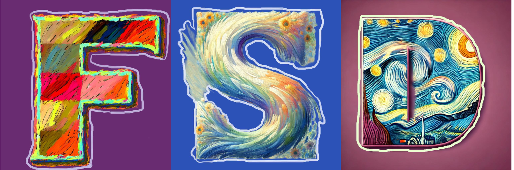

# Fire and Smoke Detection with Burning Intensity Representation

  

  

 

  

  &nbsp;&nbsp;&nbsp;

  

  &nbsp;&nbsp;&nbsp;

  <a href="https://github.com/XiaoyiHan6/FSDmethod" target='_blank'>

    

 

  </a>

  <strong>Fire and Smoke Detection with Burning Intensity Representation</strong>

     

        <a href="https://xiaoyihan6.github.io/">Xiaoyi Han</a>,
        
	Yanfei Wu,

        <a href="https://tpcd.github.io/">Nan Pu</a>,

        <a href="https://person.zju.edu.cn/fengzunlei">Zunlei Feng</a>, 

        <a href="https://person.zju.edu.cn/beiyj">Yijun Bei</a>,

        <a href="https://person.zju.edu.cn/zhangqf">Qifei Zhang</a>,

        <a href="https://faculty.hfut.edu.cn/ChengLechao/zh_CN/index.htm">Lechao Cheng</a>, 

     

  Zhejiang University & University of Trento & Hefei University of Technology & Suzhou City University

  

---

Our paper has been accepted by acm mm asia2024, and the specific code release time will be after oct. 11.

This repository is the official implementation of our paper titled "Fire and Smoke Detection with Representation of Burning Intensity". It includes our Fire and Smoke Detection (FSD) method code and several General Object Detection (SSD, RetinaNet, Faster RCNN, FCOS, and our method). We standardized the coding style for easier use. The repository will be made available until it is accepted.

---

**Note**: Could you please give me a "one-click triple support"🔥 ("**Star**"🚀,"**Fork**"🔖,"**Issues**"❓) 
